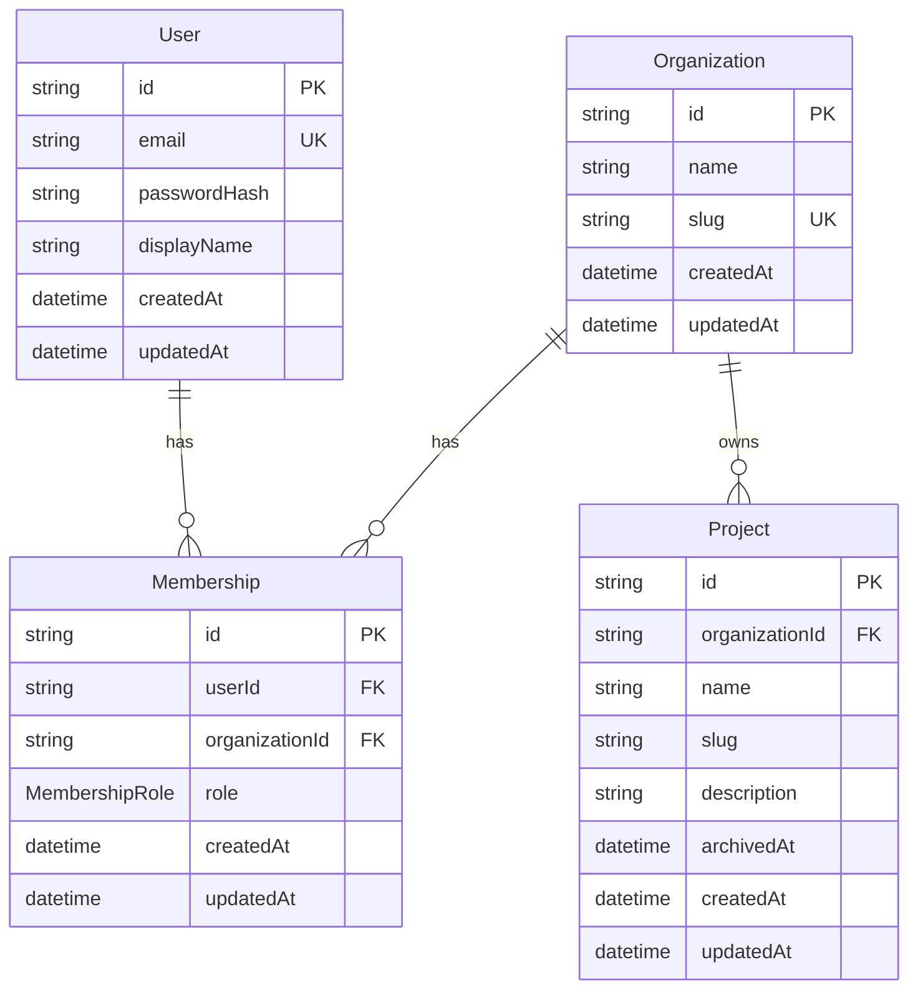

# M1 data model - Identity and workspace

## Purpose

This document defines the persistent model and invariants for M1. The Prisma
schema is the executable database definition; this document explains the
meaning of that schema and the rules the backend must enforce around it.

M1 establishes the ownership boundary required by later TokenScope features:

```text
User → Membership → Organization → Project
```

API keys, traces, cost records, and dashboards are M2 concerns. They will be
scoped to a `Project`, so M1 must make project ownership and access reliable
before those records exist.

## Entity relationship



## Entities

### User

`User` is a global TokenScope identity. A user may belong to zero, one, or
many organizations.

| Field | Meaning | Rules |
|---|---|---|
| `id` | Stable user identifier | UUID generated by the database layer |
| `email` | Sign-in identifier | Required, normalized to lowercase before persistence, globally unique |
| `passwordHash` | Password verifier | Required, contains an Argon2id hash, never returned by the API |
| `displayName` | Name shown in the UI | Required |
| `createdAt` | Creation timestamp | Generated automatically |
| `updatedAt` | Last update timestamp | Updated automatically |

The backend must never expose a raw Prisma `User` object. It must map it to a
safe response that omits `passwordHash`.

### Organization

`Organization` is the M1 tenant boundary. Members collaborate through an
organization, and all projects belong to one organization.

| Field | Meaning | Rules |
|---|---|---|
| `id` | Stable organization identifier | UUID generated by the database layer |
| `name` | Display name | Required |
| `slug` | Human-readable stable identifier | Required, globally unique, generated at creation |
| `createdAt` | Creation timestamp | Generated automatically |
| `updatedAt` | Last update timestamp | Updated automatically |

The organization slug does not change when the organization is renamed in M1.
Organization deletion is out of scope for M1.

### Membership

`Membership` materializes the many-to-many relationship between `User` and
`Organization`. Its `role` is scoped to that organization.

A user can therefore be an `OWNER` in one organization, an `ADMIN` in
another, and a `MEMBER` in a third.

| Field | Meaning | Rules |
|---|---|---|
| `id` | Stable membership identifier | UUID generated by the database layer |
| `userId` | Related user | Required foreign key |
| `organizationId` | Related organization | Required foreign key |
| `role` | Organization-scoped permission level | `OWNER`, `ADMIN`, or `MEMBER`; defaults to `MEMBER` |
| `createdAt` | Creation timestamp | Generated automatically |
| `updatedAt` | Last update timestamp | Updated automatically |

The pair `(organizationId, userId)` is unique: one user has exactly one role
inside a given organization.

Organization ownership is represented only by `Membership.role = OWNER`.
There is deliberately no `Organization.ownerId`, because two ownership
representations could disagree.

### MembershipRole

| Role | Meaning |
|---|---|
| `OWNER` | Controls the organization, its memberships, and its projects |
| `ADMIN` | Manages projects but not the organization or memberships |
| `MEMBER` | Reads the organization, memberships, and projects |

The exact permission matrix is defined in
[`SECURITY.md`](./SECURITY.md#authorization-matrix).

### Project

`Project` is an isolated TokenScope workspace owned by an organization. It is
never owned directly by a user; access is inherited from organization
membership.

| Field | Meaning | Rules |
|---|---|---|
| `id` | Stable project identifier | UUID generated by the database layer |
| `organizationId` | Owning tenant | Required foreign key |
| `name` | Display name | Required |
| `slug` | Stable project identifier within the organization | Required, generated at creation |
| `description` | Optional project description | Nullable |
| `archivedAt` | Archive timestamp | `null` while active; set on archive |
| `createdAt` | Creation timestamp | Generated automatically |
| `updatedAt` | Last update timestamp | Updated automatically |

The pair `(organizationId, slug)` is unique. Different organizations may use
the same project slug.

Project slugs are immutable in M1. Archiving a project does not release its
slug, so an archived project continues to reserve that slug inside its
organization. This preserves historical identity and matches the current
database constraint.

## Database-enforced invariants

PostgreSQL, through the committed Prisma migration, guarantees:

| Invariant | Mechanism |
|---|---|
| Every entity has a stable primary key | Primary-key constraint |
| User emails are unique | Unique index on `User.email` |
| Organization slugs are globally unique | Unique index on `Organization.slug` |
| A user has at most one membership per organization | Composite unique index on `Membership(organizationId, userId)` |
| Project slugs are unique inside an organization | Composite unique index on `Project(organizationId, slug)` |
| Memberships reference existing users and organizations | Foreign keys |
| Projects reference an existing organization | Foreign key |
| Parents with dependent memberships or projects cannot be deleted accidentally | `ON DELETE RESTRICT` |
| Roles contain only known values | PostgreSQL `MembershipRole` enum |

The corresponding integration tests live in
`backend/test/database/data-model.integration.spec.ts`.

## Backend-enforced invariants

The schema cannot completely enforce these rules. Backend services must enforce
and test them:

1. Creating an organization also creates an `OWNER` membership for the
   authenticated creator in the same atomic Prisma operation.
2. Every organization retains at least one `OWNER`.
3. Removing or demoting the last owner is rejected with `409 Conflict`.
4. Owner-count verification and owner removal/demotion execute in one
   transaction so concurrent requests cannot violate the invariant.
5. Only organization members may read that organization's data.
6. Role requirements are enforced by the backend for every mutation.
7. Project access always includes both `organizationId` and `projectId`;
   a project ID alone is never an authorization boundary.
8. Archived projects are excluded from normal list, detail, update, and access
   queries.
9. Emails are trimmed and lowercased before lookup or persistence.
10. Slugs are generated consistently, validated as non-empty, and checked
    through database uniqueness constraints. A race that reaches the unique
    constraint is mapped to `409 Conflict`.

## Lifecycle rules

### Organization creation

Organization creation and initial-owner membership creation form one business
operation. Use a nested Prisma write or a database transaction. A state where
the organization exists without an owner must never be externally visible.

### Membership changes

M1 adds already-registered users by normalized email; invitation emails are out
of scope. Membership removal deletes only the membership, not the global user.

Multiple owners are allowed. An owner may remove or demote another owner/or
themselves only if at least one owner remains.

### Project archive

M1 does not hard-delete projects. Archiving sets `archivedAt` once and returns
the project to an inaccessible state for normal M1 operations. There is no
restore endpoint in M1.

This boundary lets M2 attach API keys, traces, and cost history without relying
on destructive project deletion.

## Data access rule

Frontend role checks improve the user experience but do not protect data.
Every backend organization/project operation derives the current user from the
verified authentication token and applies membership and role checks before
returning or changing data.

Concrete query and authorization requirements are defined in
[`SECURITY.md`](./SECURITY.md).

## Source of truth

- Prisma schema: `backend/prisma/schema.prisma`
- Initial migration:
  `backend/prisma/migrations/20260815192357_init_identity_workspace/migration.sql`
- Database integration tests:
  `backend/test/database/data-model.integration.spec.ts`

If a schema change is accepted, update the Prisma schema, migration, integration
tests, this document, and the API contract in the same pull request.
