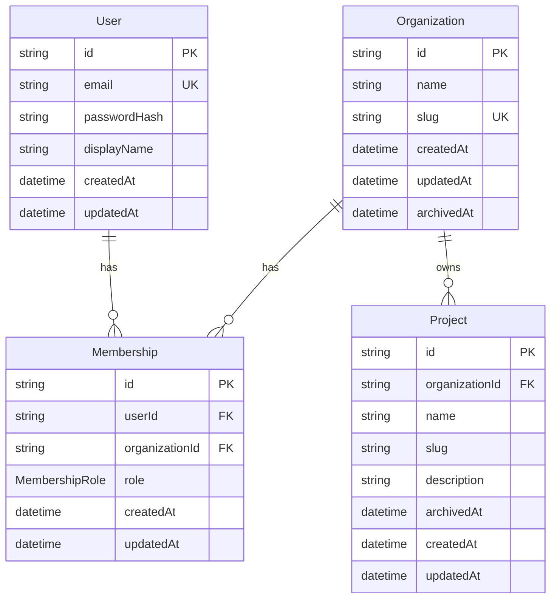

# TokenScope data model

## Purpose
This document describes the implemented identity/workspace schema and the explicitly marked evaluation extensions.

The original entity sections describe the baseline at `854da94`. The evaluation section describes agreed additions awaiting migration.

The Prisma schema and committed migrations define the implemented database structure. This document explains persistent meaning, constraints and lifecycle requirements.


## Entity relationship


```mermaid
erDiagram
    User ||--o{ Membership : has
    Organization ||--o{ Membership : has
    Organization ||--o{ Project : owns

    User {
        string id PK
        string email UK
        string passwordHash
        string displayName
        datetime createdAt
        datetime updatedAt
    }

    Organization {
        string id PK
        string name
        string slug UK
        datetime createdAt
        datetime updatedAt
        datetime archivedAt
    }

    Membership {
        string id PK
        string userId FK
        string organizationId FK
        MembershipRole role
        datetime createdAt
        datetime updatedAt
    }

    Project {
        string id PK
        string organizationId FK
        string name
        string slug
        string description
        datetime archivedAt
        datetime createdAt
        datetime updatedAt
    }
```

## Entities

### User

`User` is a global TokenScope identity. A user may belong to zero, one, or
many organizations.

| Field | Meaning | Rules |
|---|---|---|
| `id` | Stable user identifier | UUID generated by the database layer |
| `email` | Sign-in identifier | Required, normalized to lowercase before persistence, globally unique |
| `passwordHash` | Password verifier | Required, contains an Argon2id hash, never returned by the API |
| `displayName` | Name shown in the UI | Required |
| `createdAt` | Creation timestamp | Generated automatically |
| `updatedAt` | Last update timestamp | Updated automatically |

The backend must never expose a raw Prisma `User` object. It must map it to a
safe response that omits `passwordHash`.

### Organization

`Organization` is the M1 tenant boundary. Members collaborate through an
organization, and all projects belong to one organization.

| Field | Meaning | Rules |
|---|---|---|
| `id` | Stable organization identifier | UUID generated by the database layer |
| `name` | Display name | Required |
| `slug` | Human-readable stable identifier | Required, globally unique, generated at creation |
| `createdAt` | Creation timestamp | Generated automatically |
| `updatedAt` | Last update timestamp | Updated automatically |
| `archivedAt` | Soft-archive timestamp | Nullable; `null` while the organization is active |

The organization slug does not change when the organization is renamed in M1.
Organizations are never hard-deleted. An owner archives an organization by
setting `archivedAt` once (see "Organization archive" below).

### Membership

`Membership` materializes the many-to-many relationship between `User` and
`Organization`. Its `role` is scoped to that organization.

A user can therefore be an `OWNER` in one organization, an `ADMIN` in
another, and a `MEMBER` in a third.

| Field | Meaning | Rules |
|---|---|---|
| `id` | Stable membership identifier | UUID generated by the database layer |
| `userId` | Related user | Required foreign key |
| `organizationId` | Related organization | Required foreign key |
| `role` | Organization-scoped permission level | `OWNER`, `ADMIN`, or `MEMBER`; defaults to `MEMBER` |
| `createdAt` | Creation timestamp | Generated automatically |
| `updatedAt` | Last update timestamp | Updated automatically |

The pair `(organizationId, userId)` is unique: one user has exactly one role
inside a given organization.

Organization ownership is represented only by `Membership.role = OWNER`.
There is deliberately no `Organization.ownerId`, because two ownership
representations could disagree.

### MembershipRole

| Role | Meaning |
|---|---|
| `OWNER` | Controls the organization, its memberships, and its projects |
| `ADMIN` | Manages projects but not the organization or memberships |
| `MEMBER` | Reads the organization, memberships, and projects |

The exact permission matrix is defined in
[`SECURITY.md`](./SECURITY.md#authorization-matrix).

### Project

`Project` is an isolated TokenScope workspace owned by an organization. It is
never owned directly by a user; access is inherited from organization
membership.

| Field | Meaning | Rules |
|---|---|---|
| `id` | Stable project identifier | UUID generated by the database layer |
| `organizationId` | Owning tenant | Required foreign key |
| `name` | Display name | Required |
| `slug` | Stable project identifier within the organization | Required, generated at creation |
| `description` | Optional project description | Nullable |
| `archivedAt` | Archive timestamp | `null` while active; set on archive |
| `createdAt` | Creation timestamp | Generated automatically |
| `updatedAt` | Last update timestamp | Updated automatically |

The pair `(organizationId, slug)` is unique. Different organizations may use
the same project slug.

Project slugs are immutable in M1. Archiving a project does not release its
slug, so an archived project continues to reserve that slug inside its
organization. This preserves historical identity and matches the current
database constraint.

## Database-enforced invariants

PostgreSQL, through the committed Prisma migration, guarantees:

| Invariant | Mechanism |
|---|---|
| Every entity has a stable primary key | Primary-key constraint |
| User emails are unique | Unique index on `User.email` |
| Organization slugs are globally unique | Unique index on `Organization.slug` |
| A user has at most one membership per organization | Composite unique index on `Membership(organizationId, userId)` |
| Project slugs are unique inside an organization | Composite unique index on `Project(organizationId, slug)` |
| Memberships reference existing users and organizations | Foreign keys |
| Projects reference an existing organization | Foreign key |
| Parents with dependent memberships or projects cannot be deleted accidentally | `ON DELETE RESTRICT` |
| Roles contain only known values | PostgreSQL `MembershipRole` enum |

The corresponding integration tests live in
`backend/test/database/data-model.integration.spec.ts`.

## Backend-enforced invariants

The schema cannot completely enforce these rules. Backend services must enforce
and test them:

1. Creating an organization also creates an `OWNER` membership for the
   authenticated creator in the same atomic Prisma operation.
2. Every organization retains at least one `OWNER`.
3. Removing or demoting the last owner is rejected with `409 Conflict`.
4. Owner-count verification and owner removal/demotion execute in one
   transaction so concurrent requests cannot violate the invariant.
5. Only organization members may read that organization's data.
6. Role requirements are enforced by the backend for every mutation.
7. Project access always includes both `organizationId` and `projectId`;
   a project ID alone is never an authorization boundary.
8. Archived projects are excluded from normal list, detail, update, and access
   queries.
9. Emails are trimmed and lowercased before lookup or persistence.
10. Slugs are generated consistently, validated as non-empty, and checked
    through database uniqueness constraints. A race that reaches the unique
    constraint is mapped to `409 Conflict`.
11. Archived organizations are excluded from every organization, membership,
    and project access query. Child records carry no archive field of their own;
    they become inaccessible through the active-parent check.

## Lifecycle rules

### Organization creation

Organization creation and initial-owner membership creation form one business
operation. Use a nested Prisma write or a database transaction. A state where
the organization exists without an owner must never be externally visible.

### Membership changes

M1 adds already-registered users by normalized email; invitation emails are out
of scope. Membership removal deletes only the membership, not the global user.

Multiple owners are allowed. An owner may remove or demote another owner/or
themselves only if at least one owner remains.
### Organization archive

Archiving sets `Organization.archivedAt` once and leaves memberships and
projects untouched. They become inaccessible because every access query also
requires an active organization. There is no restore operation. An archived
organization keeps reserving its slug.

### Project archive

M1 does not hard-delete projects. Archiving sets `archivedAt` once and returns
the project to an inaccessible state for normal M1 operations. There is no
restore endpoint in M1.

This boundary lets M2 attach API keys, traces, and cost history without relying
on destructive project deletion.

## Data access rule

Frontend role checks improve the user experience but do not protect data.
Every backend organization/project operation derives the current user from the
verified authentication token and applies membership and role checks before
returning or changing data.

Concrete query and authorization requirements are defined in
[`SECURITY.md`](./SECURITY.md).

## Source of truth

- Prisma schema: `backend/prisma/schema.prisma`
- Initial migration:
  `backend/prisma/migrations/20260815192357_init_identity_workspace/migration.sql`
- Database integration tests:
  `backend/test/database/data-model.integration.spec.ts`

If a schema change is accepted, update the Prisma schema, migration, integration
tests, this document, and the API contract in the same pull request.

## Evaluation persistence foundation — TSE-64

TSE-64 adds the evaluation-resource schema, the Organization.archivedAt field and its migration.

The schema includes ApiKey, ModelPrice, Trace, ProjectDocument and
FileDeletionJob. Feature endpoints and workflows are implemented
by their owning tickets.

TSE-66 implements the organization archive operation and UI using
the field and access rules supplied by TSE-64.

At baseline `854da94`, none of the new models below exists.

### Migration rules

- Add new migrations; do not edit already-applied migrations.
- Preserve existing data, IDs, relationships and project archive state.
- Preserve existing ID storage types and generated-client conventions.
- Keep restrictive foreign-key behavior.
- Coordinate a single addition of `Organization.archivedAt`.
- Test both an empty-database migration and an upgrade with existing workspace data.
- Do not use `db push` as proof that migrations work.

### Organization archive

Add nullable `archivedAt`.

Existing organizations remain active with `null`.

Archive updates the organization row and its update timestamp. It does not archive every project individually, delete memberships, revoke each key row or delete document files.

Access queries must enforce active parents. Retained children are inaccessible through normal routes.

Organization and project slug uniqueness remains unchanged. No restore endpoint or archive-bypass option is introduced.

### New persistent resources

| Model | Required data and invariants |
|---|---|
| `ApiKey` | Project and creator references, name, unique SHA-256 digest, display prefix, creation time, nullable last-used/revoked times |
| `ModelPrice` | Provider, model, effective date, input/output USD rates, currency, source URL, synthetic flag and creation time |
| `Trace` | Project/external identity, normalized usage fields, historical price reference and rate snapshots, stored costs, metadata, version, payload hash, timestamps and nullable deletion time |
| `ProjectDocument` | Project/uploader references, display filename, unique server storage key, validated media type, byte size, SHA-256 digest and creation time |
| `FileDeletionJob` | Unique storage key, attempt count, next-attempt time, safe error code and creation time |

No conversation, assistant-message, embedding or persisted analytics-snapshot table is required.

### API keys

- Store no plaintext or reversible secret.
- Names have a maximum of 64 characters.
- Digest is a 64-character SHA-256 hexadecimal value.
- Display prefix has a maximum of 12 characters.
- Index project listing by project ID, creation time and ID.
- Revocation retains the row.
- The credential belongs to its project; creator removal does not automatically revoke it.
- Authentication rejects keys whose organization or project is archived.

### Historical prices and traces

Model-price uniqueness:

```text
(provider, model, effectiveFrom)
```

Trace uniqueness:

```text
(projectId, externalId)
```

Trace uniqueness includes tombstones. Do not replace it with a partial constraint excluding deleted rows.

Use:

- `Decimal(18,6)` for catalogue rates and trace rate snapshots.
- `Decimal(24,12)` for stored costs.
- Bounded integers for individual token counts and latency.
- Positive trace version, initially 1.
- A JSON object for metadata, initially `{}`.

Rate bounds are 0 through `999999.999999`.

Token bounds are 0 through 1,000,000,000 per counter. Latency is 0 through 86,400,000 milliseconds.

Required trace indexes cover:

```text
(projectId, deletedAt, occurredAt, id)
(projectId, deletedAt, provider, model, occurredAt)
(projectId, deletedAt, status, occurredAt)
```

Do not add indexes for every possible sort without an actual query need.

A referenced price cannot be deleted. New price versions do not reprice existing traces.

An actual correction updates the trace’s writable data, historical-price association, rate snapshots, costs, hash and version atomically.

A read, POST replay or no-op PUT preserves stored history.

Trace deletion retains the row and external ID while excluding it from ordinary reads and aggregates.

The persisted historical rate snapshots on Trace are named:

- inputUsdPerMillion: Decimal(18,6)
- outputUsdPerMillion: Decimal(18,6)

The associated catalogue row is referenced through priceVersionId
and the Prisma relation priceVersion.

These snapshot values belong to the stored trace. Normal reads
must not replace them with current catalogue rates.

The Prisma schema is authoritative for exact persisted field names:
[backend/prisma/schema.prisma](../backend/prisma/schema.prisma).

### Private documents

File bytes live outside PostgreSQL in private storage.

`originalName` is display data with a maximum of 255 UTF-8 bytes. Use a storage representation that supports the accepted value and enforce the byte limit consistently. Do not retain a conflicting 120-character restriction.

`storageKey` is a unique server-generated UUID string, never a client path.

Allowed media types:

```text
application/pdf
text/plain
text/markdown
```

File size is 1 through 10,485,760 bytes.

Index documents by project ID, creation time and ID.

Parent archive retains document metadata and bytes. Orphan cleanup must inspect all document references, including those under archived parents.

Individual deletion removes metadata and inserts a file-deletion job in one transaction.

The cleanup job must survive removal of the document row. Do not require a foreign key to that deleted row. Retain failed jobs until cleanup succeeds.

### Database constraints versus service validation

Use database constraints for:

- Primary and foreign keys.
- Key-hash, price-version and trace external-ID uniqueness.
- Counter, rate, cost and file-size bounds.
- Positive trace versions.
- Nonnegative cleanup attempts.
- USD-only currency and supported media types.
- Metadata being a JSON object.

DTOs and services additionally enforce normalization, detailed metadata limits, byte limits, timestamp rules, actual file-content validation and authorization.

A successful DTO test does not prove that database constraints exist.

SHA-256 digest fields use 64 lowercase hexadecimal characters.

The migration rejects numeric NaN for stored costs. Rate upper
bounds also reject NaN.

The document filename limit is enforced as 1–255 UTF-8 bytes.

Services remain responsible for normalized identifiers, exact
cost calculation, price selection, generated UUID storage keys,
file-content validation and authorization.
