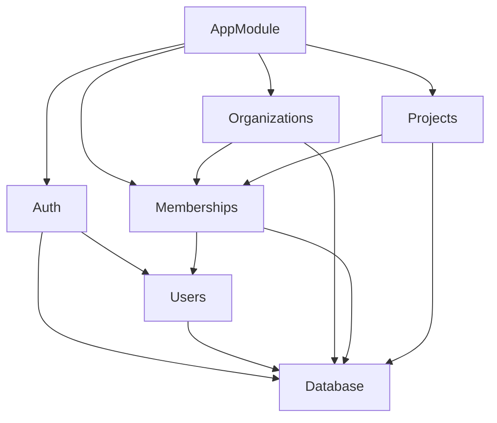

# TokenScope Sprint 1 — Identity & Workspace Foundation

**Sprint 1 goal:**
Build the authenticated workspace foundation required for every later TokenScope feature.
This document is architectural contract for the backend team: which modules, what each module owns, how request flow and which dependencies are allowed.

Endpoint payloads belong in [API.md](./API.md), authorization policy belongs
in [SECURITY.md](./SECURITY.md), persistent invariants belong in
[DATA_MODEL.md](./DATA_MODEL.md), and executable verification steps belong
in [DEMO.md](./DEMO.md). Keeping those responsibilities separate prevents
the same contract from drifting across several files.

## Sprint 1 demo target
```text
User A signs up
→ User A creates an organization
→ User A creates a project
→ User B signs up
→ User A adds User B to the organization
→ User B logs in
→ User B sees the shared organization and project
→ Unauthorized access to another organization is rejected
```

M1 is complete only when this flow works through the real frontend and backend,
including validation, authorization, persistence, tests, documentation, and a
clean-browser demo.

## Architecture scope

```text
- user sign-up and sign-in;
- JWT bearer authentication and current-user loading;
- protected frontend and backend routes;
- organization create, list, detail, and rename;
- organization membership list, add, role change, and removal;
- organization-scoped OWNER, ADMIN, and MEMBER permissions;
- project create, list, detail, update, and soft archive;
- tenant isolation for every organization and project operation;
- consistent validation and error responses;
- integration of the existing mocked frontend with the real API;
- database, service, controller, authorization, and end-to-end tests;
- the repeatable two-user demo.
```

## Sprint 1 No Goals
```text
- No API keys.
- No traces ingestion.
- No LLM cost calculation and models price records.
- No dashboard analytics.
- No RAG, documents, embeddings, and AI recommendations.
- No email invitations and passwords reset;
- No WebSockets.
- No refresh tokens, server-side sessions, and token revocation
- No organization deletion;
- No project restore;
- No project-specific roles or ACLs (Access Control List)
```
API keys, traces, cost calculation, and dashboards begin in M2. They must build
on the M1 rule that every project is owned by exactly one organization and is
accessible only through organization membership.


## Current baseline

At the start of backend M1 implementation:

- the React routes, pages, role-aware UI, and domain API functions exist with
mocked persistence;
- the Prisma models, initial migration, seed, and database integration tests
exist;
- the NestJS backend exposes only health/database-health endpoints;
- authentication, users, organizations, memberships, projects, and shared HTTP
infrastructure still need real backend modules.

The mock API describes intended user behavior, but [API.md](./API.md) is the
canonical HTTP contract. When the two disagree, update the mock/frontend
integration to the documented contract.

## Architectural style

TokenScope is a modular monolith. Each domain has a NestJS module with a narrow
responsibility, while every module shares one PostgreSQL database through
Prisma.

The design does not introduce microservices, repositories for every entity, a
generic base service, or a second authorization framework. M1 favors explicit
domain services and dependencies that the whole team can trace.

## Backend module boundaries

| Module | Owns | Does not own |
|---|---|---|
| `database` | Prisma client lifecycle and database access infrastructure | Business rules or HTTP behavior |
| `auth` | Sign-up/sign-in orchestration, password verification, JWT creation/verification, authentication guard | Organization/project permissions |
| `users` | User persistence operations and safe-user mapping | Tokens, organization roles, or projects |
| `organizations` | Organization create/list/detail/rename and atomic initial-owner creation | Later membership management |
| `memberships` | Membership list/add/update/remove, last-owner rule, organization membership/role assertions | Project lifecycle |
| `projects` | Project create/list/detail/update/archive and project-resource scoping | Independent project ACLs |
| `common` | Request IDs, shared decorators/types, validation/error infrastructure | Domain-specific authorization or Prisma queries |
| `health` | Liveness and database-readiness endpoints | Business behavior |

Membership is a first-class module because it owns the relationship that grants
organization access. It is not hidden inside `organizations`, and generic
`common` code must not contain tenant policy.

## Target backend structure

```text
src/
  app.module.ts
  main.ts
  database/
    database.module.ts
    prisma.service.ts
  health/
    health.controller.ts
    health.module.ts
  auth/
    auth.controller.ts
    auth.module.ts
    auth.service.ts
    dto/
      sign-in.dto.ts
      sign-up.dto.ts
    guards/
      jwt-auth.guard.ts
    token.service.ts
  users/
    users.module.ts
    users.service.ts
    user.mapper.ts
  organizations/
    organizations.controller.ts
    organizations.module.ts
    organizations.service.ts
    dto/
      create-organization.dto.ts
      update-organization.dto.ts
  memberships/
    memberships.controller.ts
    memberships.module.ts
    memberships.service.ts
    organization-access.service.ts
    dto/
      add-member.dto.ts
      update-member-role.dto.ts
  projects/
    projects.controller.ts
    projects.module.ts
    projects.service.ts
    project-access.service.ts
    dto/
      create-project.dto.ts
      update-project.dto.ts
  common/
    decorators/
      current-user.decorator.ts
      public.decorator.ts
    filters/
      api-exception.filter.ts
    middleware/
      request-id.middleware.ts
    types/
      authenticated-user.ts
      api-error.ts
    utils/
      slug.ts
```

Exact filenames may change during implementation, but module ownership and
dependency direction must remain stable.

## Dependency rules



Rules:

1. Controllers call their own domain service; they never call Prisma.
2. Domain services may call Prisma and explicitly exported services from a
   lower dependency.
3. `OrganizationsService` may create the initial `OWNER` membership as part
   of one nested/transactional organization-creation operation. All subsequent
   membership changes belong to `MembershipsService`.
4. `OrganizationsService` and `ProjectsService` use the membership access
   service for organization-scoped authorization.
5. `ProjectsService` additionally verifies that a project belongs to the
   organization in the route.
6. `AuthModule` may depend on `UsersModule`; `UsersModule` never depends on
   `AuthModule`.
7. Domain modules must not depend on controllers or frontend code.
8. Circular module dependencies and `forwardRef()` require an architecture
   review; they are not the default solution.
9. A repository layer is optional. Do not create one unless it removes concrete
   duplicated persistence logic. Prisma calls still remain outside controllers.

## HTTP request lifecycle

The implementation follows the actual NestJS lifecycle:

```text
HTTP request
→ request-ID middleware
→ route selection
→ JWT authentication guard
→ parameter/body ValidationPipe
→ controller
→ domain service
→ membership/role and tenant check
→ Prisma query or transaction
→ safe response mapping
→ HTTP response
```

Responsibilities:

- middleware supplies or generates `requestId`;
- the JWT guard authenticates and attaches only the trusted user identity;
- DTO classes validate untrusted body/query/route input;
- controllers translate HTTP input into service calls;
- services own business rules and transaction boundaries;
- access services own reusable membership/role assertions;
- Prisma enforces persisted constraints;
- mappers prevent fields such as `passwordHash` from leaving the backend;
- the exception filter maps known failures to the documented API error shape.

The JWT contains the user ID, not organization roles. Roles are read from the
current membership so role changes take effect immediately.

## Core flows

### Sign up

```text
POST /api/v1/auth/signup
→ validate SignUpDto
→ normalize email
→ hash password with Argon2id
→ create User
→ map duplicate email to 409
→ issue access token
→ return safe user + token
```

The plaintext password exists only during request handling. It is never logged,
persisted, or returned.

### Sign in

```text
POST /api/v1/auth/signin
→ validate SignInDto
→ load authentication record by normalized email
→ verify Argon2id hash
→ return the same generic 401 for unknown email or wrong password
→ issue access token
→ return safe user + token
```

### Create organization

```text
POST /api/v1/organizations
→ authenticate current user
→ validate name
→ generate stable slug
→ atomically create Organization and OWNER Membership
→ return OrganizationSummary with currentUserRole = OWNER
```

The organization and first owner must never be created in two independent
committed operations.

### Manage membership

```text
membership request
→ authenticate current user
→ assert OWNER role in organization
→ resolve the target registered user
→ apply add/change/remove operation
→ preserve at least one OWNER
→ return safe membership data
```

Owner removal/demotion and the last-owner check execute within one transaction.

### Access project

```text
project request
→ authenticate current user
→ assert required organization role
→ find project by projectId + organizationId + archivedAt = null
→ perform operation
→ return project response
```

Looking up a project by `projectId` alone is forbidden because it can cross
tenant boundaries.

## Authentication and logout

M1 uses a short-lived JWT access token sent as:

```http
Authorization: Bearer <access-token>
```

Sign-up and sign-in return the access token. The frontend stores the token and
attaches it through the API layer.

M1 does not claim server-side token revocation. Signing out removes the token
from the frontend and clears the authenticated UI state. A
`POST /auth/logout` endpoint is deliberately absent because a stateless
endpoint that does not invalidate the token would provide misleading security.
Refresh tokens and revocation are post-M1 hardening.

## Frontend route boundaries

The existing frontend routes remain:

```text
/signup
/signin
/organizations
/organizations/:organizationId
/organizations/:organizationId/members
/organizations/:organizationId/projects
/organizations/:organizationId/projects/:projectId
```

Integration rules:

1. Pages call files in `frontend/src/api/`; pages do not call `fetch`
   directly.
2. The API layer owns the base URL, JSON parsing, bearer header, and conversion
   of API errors into one frontend error type.
3. `AuthContext` owns the current safe user and token lifecycle.
4. Route protection is UX only. Every protected backend endpoint authenticates
   independently.
5. Role-aware rendering is UX only. Backend role checks remain authoritative.
6. API dates cross HTTP as ISO-8601 UTC strings.
7. The real integration removes mock credential/session persistence; plaintext
   mock passwords must never become a backend design.
8. The public API base is `/api/v1`. The Vite proxy must preserve that prefix
   when the real API replaces the mocks.

```text
src/
  pages/
    auth/
      SignInPage.tsx
      SignUpPage.tsx
    organizations/
      OrganizationsPage.tsx
      OrganizationDetailPage.tsx
      MembersPage.tsx
    projects/
      ProjectsPage.tsx
      ProjectDetailPage.tsx
  components/
    layout/
    forms/
    feedback/
  api/
    auth.api.ts
    organizations.api.ts
    projects.api.ts
  hooks/
    useCurrentUser.ts
    useOrganizations.ts
```
## Single M1 implementation sequence

This is dependency order inside one M1 delivery, not a set of partial product
milestones:

1. Lock `DATA_MODEL.md`, this architecture, `API.md`, `SECURITY.md`, and
   `DEMO.md`.
2. Add shared backend infrastructure: Prisma service/module, environment
   validation, global validation, request IDs, and exception mapping.
3. Implement users and the complete authentication contract.
4. Implement organization creation/read/update and initial-owner transaction.
5. Implement membership authorization helpers and complete member management.
6. Implement complete project create/read/update/archive behavior.
7. Replace frontend mock calls with the real API without changing page/domain
   boundaries unnecessarily.
8. Complete unit, integration, tenant-isolation, and end-to-end tests.
9. Run the full clean-database demo and satisfy every M1 acceptance item.

M2 starts only after this complete gate passes.

## Definition of Done
M1 is complete when all of the following are true:

- sign-up, sign-in, current-user loading, frontend sign-out, and protected
  routes work end to end;
- passwords are Argon2id hashes and `passwordHash` never appears in a response
  or log;
- authenticated users can create and view only their organizations;
- an organization is always created with its initial owner atomically;
- owners can add registered users, change roles, and remove members;
- the last owner cannot be removed or demoted;
- owners and admins can create, update, and archive projects;
- members can view but cannot mutate projects;
- every project operation is scoped by organization and excludes archives;
- an outsider cannot discover or access another tenant by changing IDs;
- API validation, status codes, errors, and response bodies match
  `docs/API.md`;
- the frontend uses the real API and has loading, error, and empty states;
- the browser console and backend logs contain no unexpected errors;
- database, service, authorization, controller, and end-to-end tests pass;
- the exact clean-database procedure in `docs/DEMO.md` succeeds;
- README links to every M1 implementation document.

## Authoritative implementation references

- [NestJS modules](https://docs.nestjs.com/modules)
- [NestJS guards](https://docs.nestjs.com/guards)
- [NestJS validation](https://docs.nestjs.com/techniques/validation)
- [NestJS exception filters](https://docs.nestjs.com/exception-filters)
- [Prisma transactions](https://www.prisma.io/docs/orm/prisma-client/queries/transactions)
